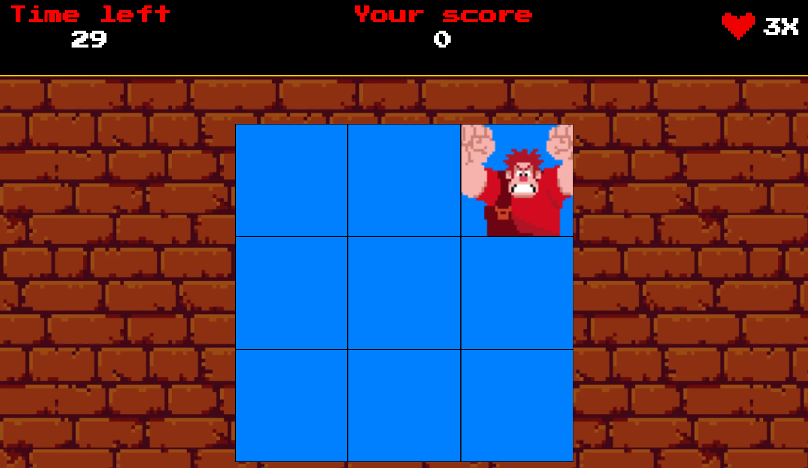

# Acerte o Ralph!
## Joguinho para aplicar os conhecimentos de Javascript aprendidos.

- Variáveis
- funções
- hoisting
- classes e objetos
- métodos e atributos
- bibliotecas

## Objetivo do jogo
Ralph aparece em uma janela aleatória, teu papel é clicar na janela na qual ele está para aumentar a tua pontuação. Você deve acertá-lo o máximo de vezes possível em 30 segundos.

 
